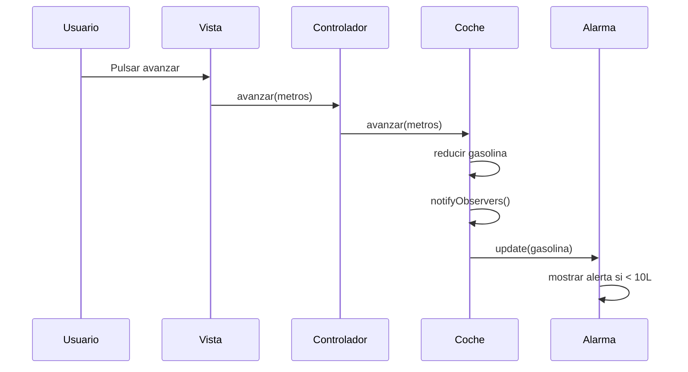

# Examen observer
Alarma de Repostaje

## Implementación

- `Coche` actúa como **Observable**.
- `AlarmaGasolina` actúa como **Observer**.
- Cada vez que se avanza o se reposta, el coche notifica a los observadores su nuevo nivel de gasolina.
- La alarma comprueba si hay que lanzar el mensaje de alerta.

## Archivos Nuevos

Observer.java`: interfaz del patrón Observer.
Observable.java`: interfaz del patrón Observable.
AlarmaGasolina.java`: implementación concreta de la alarma.

## Cambios realizados

- `Coche` ahora implementa `Observable` y notifica a sus observadores cuando cambia la gasolina.
- `ControladorCoche` agrega una instancia de `AlarmaGasolina` como observador.

## Uso

Simplemente usa la aplicación como antes. Si avanzas lo suficiente como para que la gasolina sea inferior a 10 litros, se imprimirá:

```
Alerta: Repostar
```


## Cambios Introducidos en el Código

Para implementar las funcionalidades "Avanzar (metros)" y "Poner gasolina (litros)", se realizaron los siguientes cambios en las clases del proyecto:

### `Coche.java`
- Se añadió el atributo:
    - `double gasolina`: representa los litros de gasolina disponibles (inicializado a 10.0 litros).

- Se implementó el método:
    - `void avanzar(int metros)`  
      Calcula el consumo de gasolina en función de la velocidad actual y la distancia recorrida.
     
      Imprime el nivel de gasolina tras avanzar.

- Se implementó el método:
    - `void ponerGasolina(double litros)`  
      Suma los litros indicados al atributo `gasolina` e imprime el nuevo nivel.

---

###  `Model.java`
- Se añadieron los métodos:
    - `void avanzarCoche(String matricula, int metros)`  
      Llama al método `avanzar()` del coche correspondiente.
    - `void repostarCoche(String matricula, double litros)`  
      Llama al método `ponerGasolina()` del coche correspondiente.

---

### `Controller.java`
- Se añadieron llamadas a las nuevas funcionalidades:
    - `model.avanzarCoche(matricula, metros);`
    - `model.repostarCoche(matricula, litros);`

---

###  `View.java`
- Se pueden añadir métodos para mostrar el nivel de gasolina u opciones al usuario, aunque no es imprescindible para el funcionamiento.

---

Estos cambios permiten simular con mayor realismo el comportamiento de los coches al moverse y consumir gasolina, así como permitir al usuario recargar el depósito.


# Arquitectura MVC

Aplicación que trabaja con objetos coches, modifica la velocidad y la muestra

---
## Diagrama de clases:


---

## Diagrama de Secuencia

Ejemplo básico del procedimiento, sin utilizar los nombres de los métodos


El mismo diagrama con los nombres de los métodos

